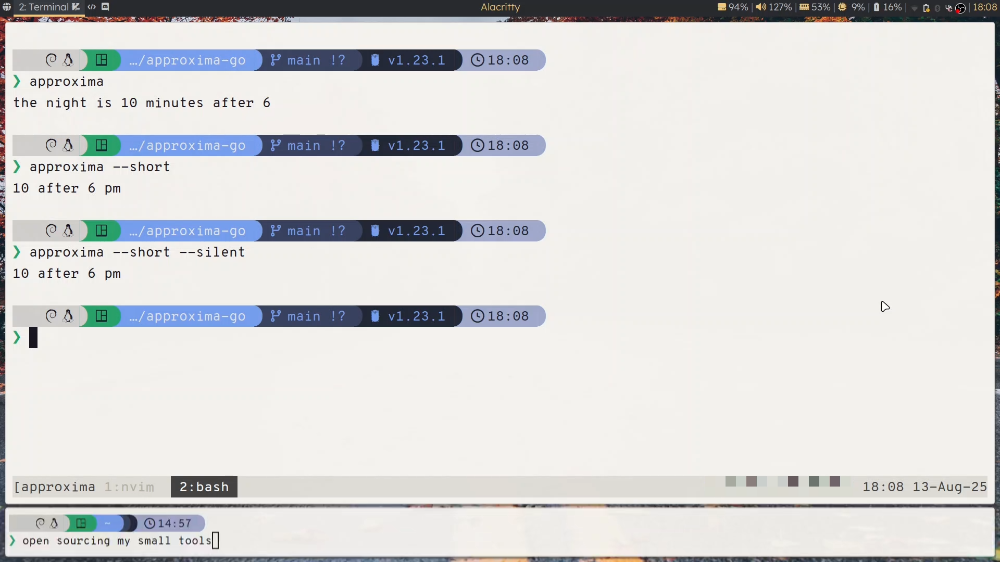

# Approxima

A command line program to loudly tell time (in chunks of 5 minutes).


[Demo of approxima and its features(with sound)](https://github.com/user-attachments/assets/90327ef6-41ab-4d21-b61c-ac108ab9288d)

## Features

- Intuitive time telling using TTS
- Pipeable into standard input and standard output
- Embedded sound files (making it portable)
- Customizable assets folder for custom sounds

## Installation

If you have at least Go 1.23, install using the following command:

```bash
go install github.com/noAbbreviation/approxima
```

> [!NOTE]
> A release may be in the works.

## Usage

```
Usage:
  approxima [OPTION]... [<HH:MM:SS>]

Pipe UNIX time as substitute for command line arguments.

Flags:
-assets string
    Asset folder to use.
-h Display this help then exit.
-help
    Display this help then exit.
-short
    Use the shorter prompt format.
-silent
    Only print the prompt then exit.
```

## Credits

Audio files generated from [ttsmaker](https://ttsmaker.com/).
